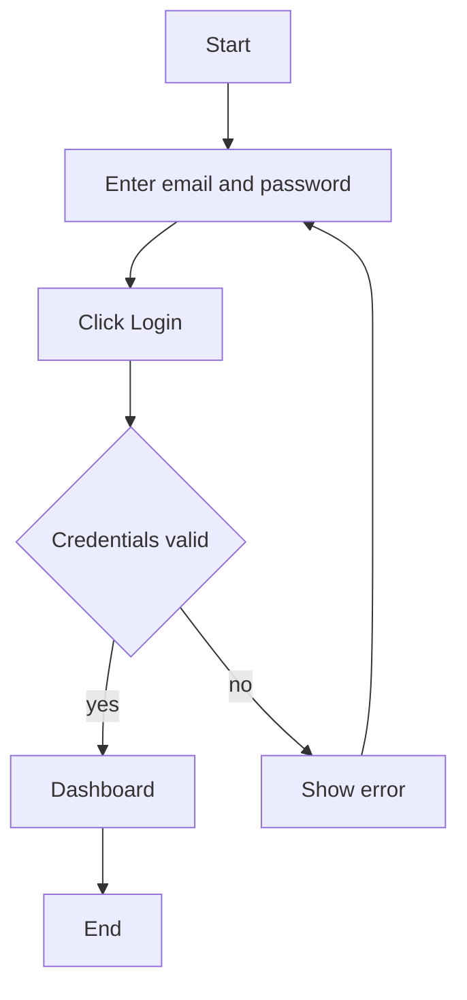
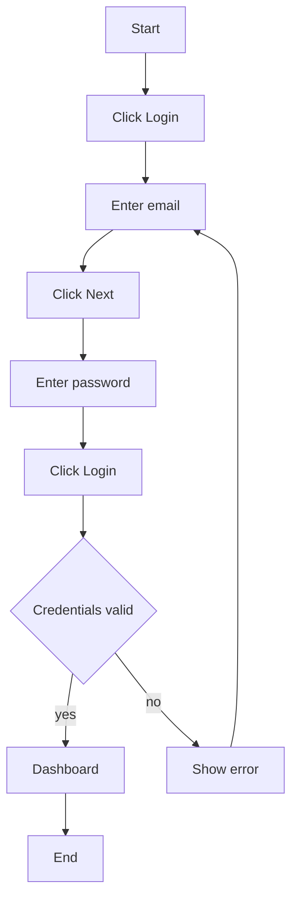

# User flow specification

Mermaid diagram with conventions to express enforzable UX decisions.
By having a single source of truth, we turn emergent implementation
bad UX side effects into conscious actionable decisions

## DSL

- `[ ]` → action or system step
- `{ }` → decision
- `-->` → transition
- `|label|` → branch condition
- One node = one action
- Use `Click ...`, `Enter ...`, etc. for user actions
- Count "Click", etc. occurrences to measure UX cost

## Examples

### Good ux design

- 1 click
- minimal steps
- fast retry loop

### Bad ux design evidenced

- multiple clicks
- unnecessary steps
- fragmented flow
