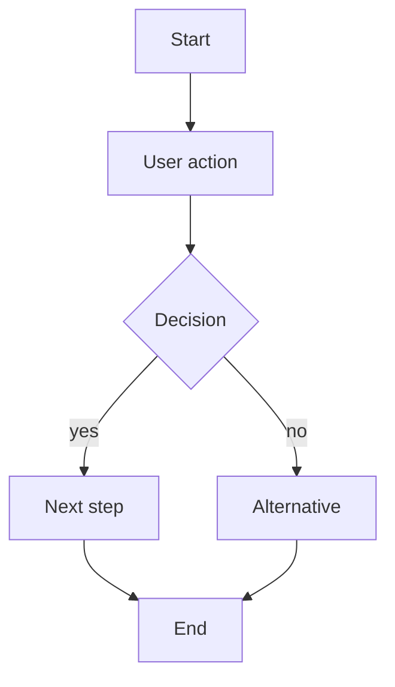
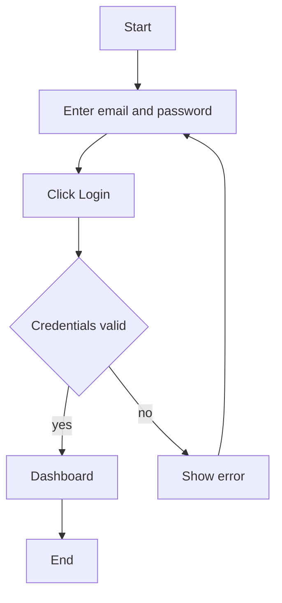
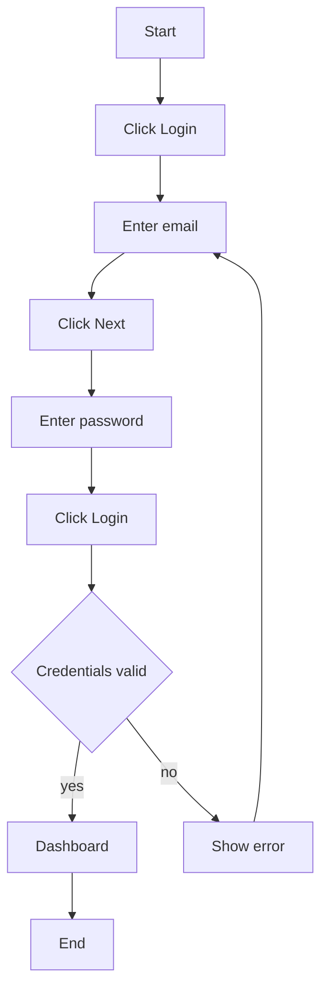

Create or edit authoritative spec arctifacts that describe a feature

## LOCATIONS

Preferred dedicated folder, flexibility to prepend the feature name if the
architecture does not allow

- <feature-name>/<artifact-name>
- <feature-name>.<artifact-name>

## FEATURE ARTIFACTS

### intent.yml

- Authoritative document for this feature's purpose as part of the product
- Used as a structured way to define product requirements that normally
  would get burried in documentation.
- By colocating them with the feature implementation, we can enforce the
  product design from vision to reality.

```yaml
domain:
  primary: "<primary-domain>"
  secondary:
    - "<secondary-domain>"
    - "<secondary-domain>"

personas:
  primary: "<primary persona>"
  secondary:
    - "<secondary persona>"
    - "<secondary persona>"

goal:
  - "<why this feature exists>"

success:
  - "<observable outcome 1>"
  - "<observable outcome 2>"

non_goals:
  - "<explicitly out of scope>"

constraints:
  - "<optional constraint>"
```

## acceptance.feature

- Authoritative document for this feature's expected behavior from the user
  perspective
- Used to design tests first that validate the desired behavior
- Implementors can propose an implementation and safely refactor
- By separating concerns we reduce unexpected behavior by arbitrary decisions
- Tests are immutable unless we deliverately change the desired behavior in
  the spec

```gherkin
Feature: <feature-name>

  Scenario: <main success scenario>
    Given <initial context>
    And <additional context>
    When <action>
    Then <expected outcome>
    And <additional outcome>

  Scenario: <edge or failure scenario>
    Given <initial context>
    When <action>
    Then <expected outcome>
```

## flow.mmd

- Autoritative document for this feature's ux design
- Used to make ux cuantifiable (clics, steps, branches)
- Implementors must strictly follow the designed flow
- By explicitely diagraming every user interaction we evidence ux design flaws
- Changes in the flow implementation need to be diagramed to revalidate ux



### Rules

- `[ ]` → action or system step
- `{ }` → decision
- `-->` → transition
- `|label|` → branch condition
- One node = one action
- Use `Click ...` to represent clicks

### Good ux design



- 1 click
- minimal steps
- fast retry loop

## Bad ux design evidenced



- multiple clicks
- unnecessary steps
- fragmented flow

## layout.json

- Authoritative document for layout design and responsiveness
- Derived from Penpot primitives in a simplified DSL
- Used to translate user Penpot designs so agents can use to propose changes
  and serve as a document of ui intent
- Implementors must use the decided css layout primitives and responsiveness
  transformations
- By deciding a layout strategy we avoid emergent arbitrary decisions

```json
{
  "type": "frame",
  "name": "login",
  "layout": "column",
  "children": [
    { "type": "text", "name": "title", "value": "Login" },
    { "type": "input", "name": "email" },
    { "type": "input", "name": "password" },
    { "type": "button", "name": "submit", "label": "Login" }
  ]
}
```

## SYSTEM ARTIFACTS

- There are also `system/` artifacts that also affect feature artifacts
- Its outside the scope of a feature planning to modify system decision
- But if the required feature requires system changes propose to the user
- Every architecture decision must be recorded in `adr/`
- Make sure you understand:
  - `system/architecture.dsl`,
  - `system/nfr.yml`
  - `system/scope.yml`
  - `system/principles.yml`

## INTERVIEW

1. Use your question tool to ask high-value, disambiguating questions
   - inputs
   - outputs
   - edge cases
   - failure modes
   - libraries
   - design patterns
   - architectureSK
2. Explore the repo to understand current state and challange their assertions
3. Walk down each decision branch resolving dependencies one by one

## UPDATE

1. Artifacts are the single source of truth
2. Your job is to refine them, not to implement the solution

## DELIVER

- Mandatory: intent.yml, acceptance.feature, flow.mmd
- If applicable: layout.json for features with ui

## NEXT

Spawn parallel subagents to implement the features with concise unambiguous
instructions:

1. Sumary of the constraints defined on the artifacts
2. Use the `tdd` skill unless its a legacy project without tests
3. Work in a git worktree checked out to a feature branch
4. Commit often in atomic units of tested code
5. Remove the worktree when done
6. Deliver reproducible solutions - you can modify a running container to
   test fixes, but the solution must be written to the image (source code)

## ITERATE

1. Use the `code-review` skill to evaluate the diff in the feature branch
2. Validate that the code changes respect all the system and feature specs
3. You can autonomously trigger fixes:

- For trivial fixes do it yourlself
- For refactors spawn a new agent with a refined prompt to spawn a worktree
  of the same branch again
- If the approach is completely wrong, delete the feature branch and spawn
  a new agent with a refined prompt
